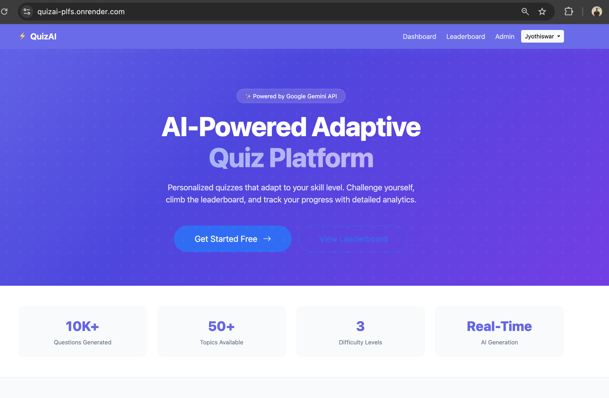
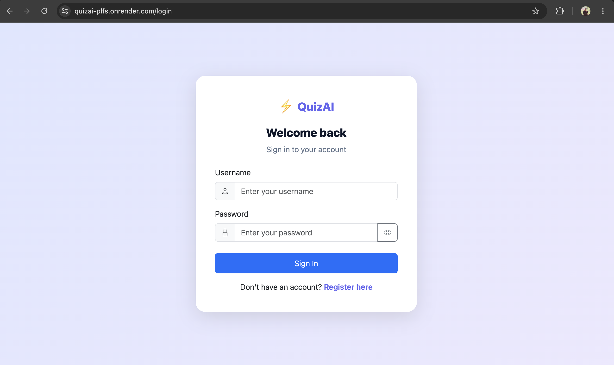
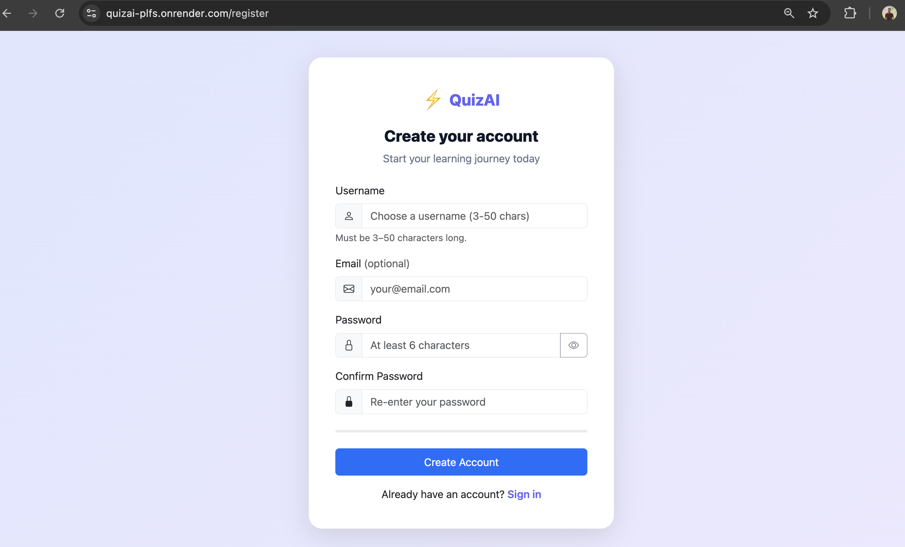
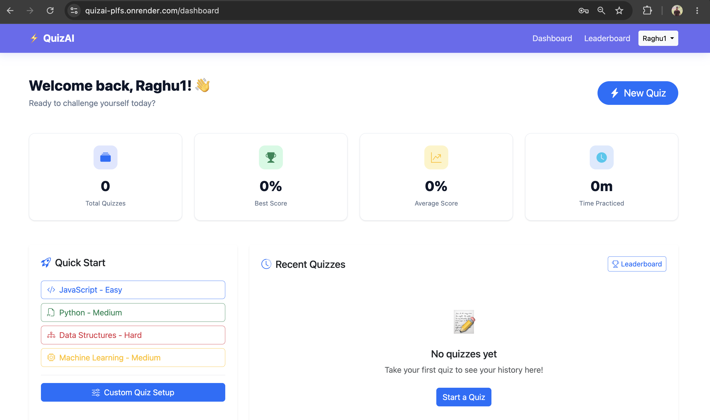
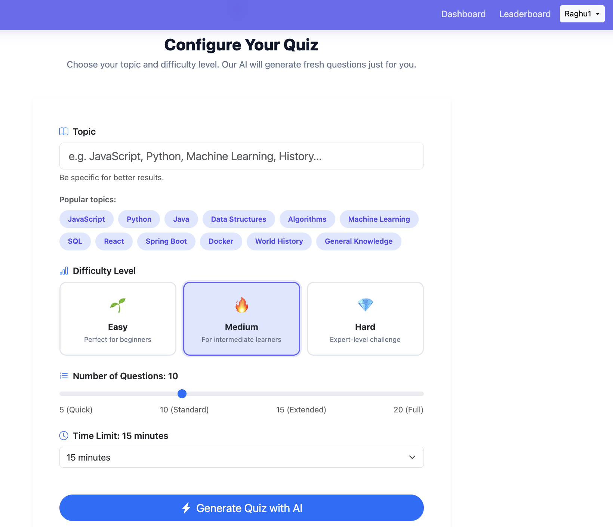
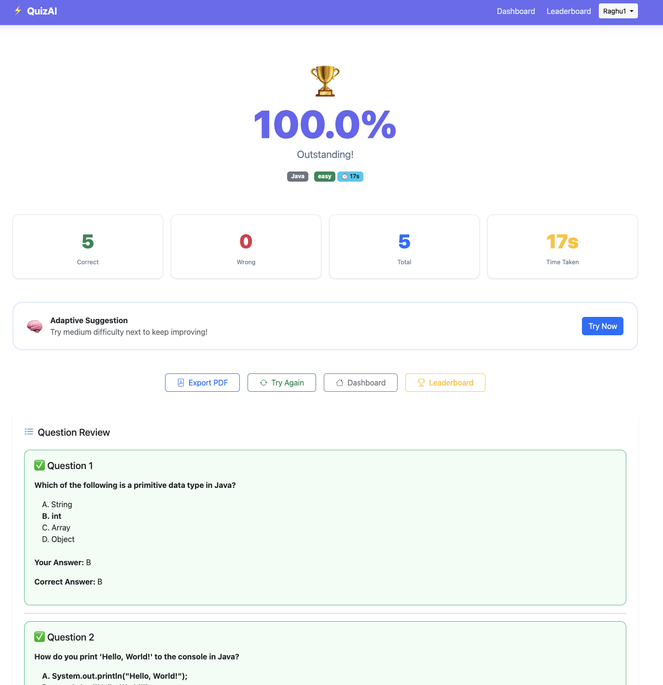
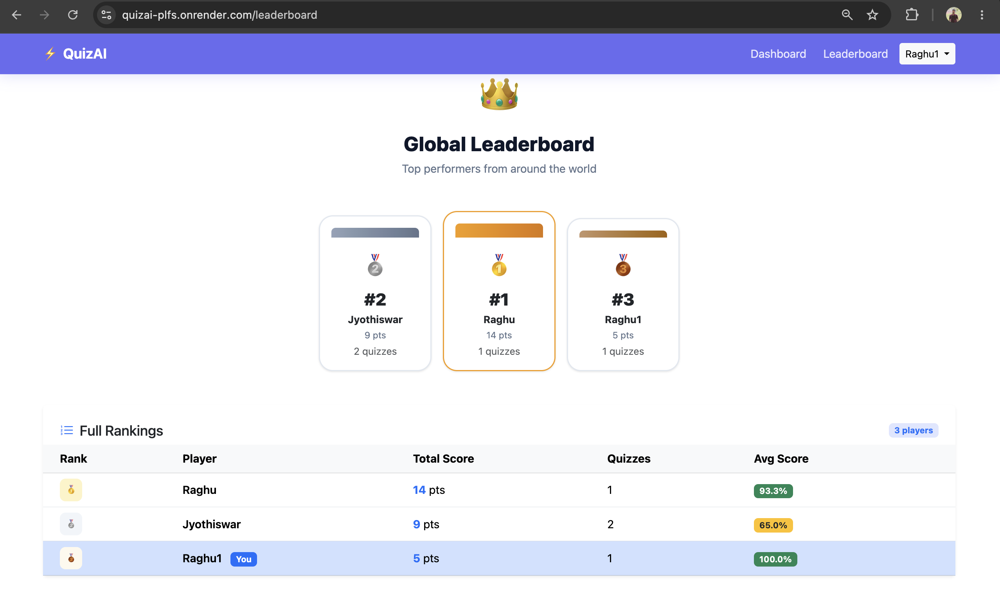
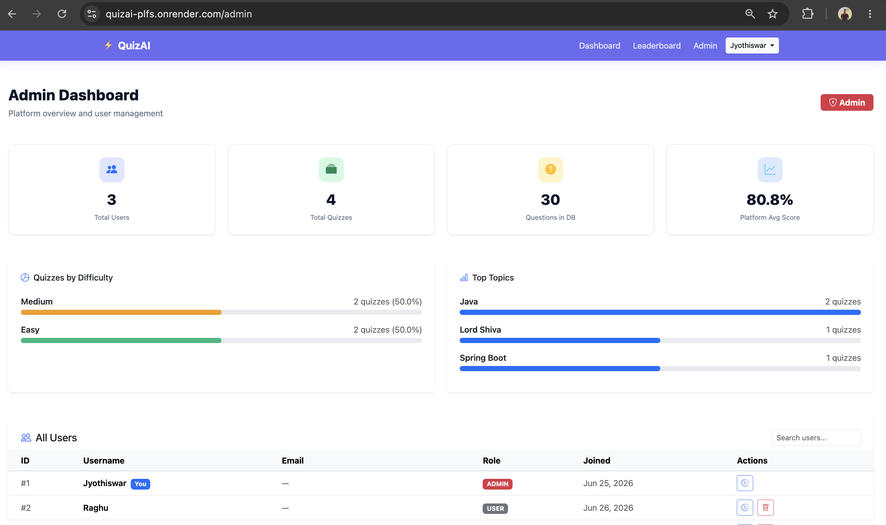

<div align="center">

# 🤖 QuizAI

### AI-Powered Quiz Platform built with Spring Boot, Gemini AI, JWT Authentication & MySQL

Generate quizzes on any topic using Google Gemini AI, attempt randomized quizzes, track performance, compete on the leaderboard, and manage the platform through an Admin Dashboard.

<br>

[](https://www.oracle.com/java/)
[](https://spring.io/projects/spring-boot)
[](https://spring.io/projects/spring-security)
[](https://www.mysql.com/)
[](https://jwt.io/)
[](https://ai.google.dev/)
[](https://www.docker.com/)
[](https://render.com/)
[](https://www.clever-cloud.com/)

</div>

---

# 🌐 Live Demo

### 🚀 Live Application

👉 https://quizai-plfs.onrender.com
---

# 📖 Overview

QuizAI is a full-stack AI-powered quiz platform that dynamically generates quizzes using Google's Gemini AI. Users can create quizzes on any topic, attempt randomized questions, view detailed results, monitor previous attempts, and compete on a global leaderboard.

The platform includes secure JWT authentication, Role-Based Access Control (RBAC), AI question caching, and an Admin Dashboard for platform management.

---

# 🚀 Highlights

- 🤖 AI-generated quizzes using Google Gemini 2.5 Flash
- 🔐 Secure JWT Authentication & RBAC
- 🏆 Leaderboard System
- 📊 Admin Dashboard
- 🗄️ MySQL Database
- 🐳 Dockerized Application
- ☁️ Deployed on Render
- 🌍 External MySQL using Clever Cloud

---

# ✨ Key Features

## 👤 Authentication

- User Registration
- Secure Login
- JWT Authentication
- BCrypt Password Encryption
- Role-Based Access Control (USER / ADMIN)

---

# 🏗 Architecture

```
                 Browser
                     │
                     ▼
       HTML • Bootstrap • JavaScript
                     │
                     ▼
          Spring Boot REST APIs
                     │
                     ▼
      Spring Security + JWT Authentication
                     │
                     ▼
              Service Layer
                     │
                     ▼
            Repository Layer
                     │
         ┌───────────┴───────────┐
         ▼                       ▼
     MySQL Database        Gemini AI API
```

---

## 🤖 AI Quiz Generation

Generate quizzes on any topic using **Google Gemini AI**.

Users can select

- Topic
- Difficulty (Easy / Medium / Hard)
- Number of Questions

Supported Question Counts

- 5
- 10
- 15
- 20

---

## 📝 Quiz System

- AI-generated MCQs
- Randomized Questions
- Automatic Score Evaluation
- Percentage Calculation
- Time Tracking
- Quiz History
- AI Question Caching
- Duplicate Question Prevention

---

## 🏆 Leaderboard

- Global Rankings
- Highest Scores
- Performance Comparison

---

## 👨‍💼 Admin Dashboard

- View Total Users
- View Total Quizzes
- View Total Questions
- Platform Statistics
- Quiz Statistics
- Topic Statistics
- User Quiz History
- Delete Users

---

# 🛠 Tech Stack

## Backend

- Java 17
- Spring Boot 3.3
- Spring Security
- Spring Data JPA
- Hibernate
- JWT Authentication
- Maven

---

## Frontend

- HTML
- CSS
- JavaScript
---

## Database

- MySQL
- Clever Cloud

---

## Artificial Intelligence

- Google Gemini API
- Gemini 2.5 Flash

---

## Deployment

- Docker
- Render
- Clever Cloud (External MySQL)

---


# 🗄 Database Design

The application uses **4 relational tables**.

- Users
- Questions
- Quizzes
- Quiz Attempts

The database is designed to eliminate duplicate AI-generated questions by storing generated questions and reusing them whenever possible.

---

# 🔐 Security

- JWT Authentication
- BCrypt Password Encryption
- Role-Based Access Control
- Protected REST APIs
- Input Validation using Bean Validation
- DTO-based Request/Response Layer

---

# 📡 REST APIs

## Authentication

```
POST /api/auth/register
POST /api/auth/login
```

---

## Quiz

```
POST /api/quiz/generate
POST /api/quiz/submit
GET  /api/quiz/history
```

---

## Leaderboard

```
GET /api/leaderboard
```

---

## Admin

```
GET    /api/admin/stats
GET    /api/admin/users
GET    /api/admin/users/{id}/history
DELETE /api/admin/users/{id}
```

---

# 📸 Screenshots

## 🏠 Home Page



---

## 🔐 Login



---

## 📝 Register



---

## 📊 Dashboard



---

## 🎯 Quiz Setup



---

## 📈 Quiz Result



---

## 🏆 Leaderboard



---

## 👨‍💼 Admin Dashboard


---

# 🧪 API Testing

All REST APIs were tested using **Postman**.

The application contains **19 REST API endpoints** covering

- Authentication
- Quiz Generation
- Quiz Submission
- Quiz History
- Leaderboard
- Admin Management

---


# 👨‍💻 Author

## Jyothiswar Yalla

📧 Email

yallajyothiswar@gmail.com

🔗 GitHub

https://github.com/Jyothiswar53

💼 LinkedIn

https://www.linkedin.com/in/jyothiswar66/

🌐 Portfolio

https://jyothiswar53.github.io/PORTFOLIO/

---

# ⭐ Support

If you found this project useful, consider giving it a **⭐ Star** on GitHub.

It helps others discover the project and motivates future improvements.

---

<div align="center">

### Thank you for visiting QuizAI ❤️

Built with Java, Spring Boot, MySQL, Docker & Google Gemini AI.

</div>
